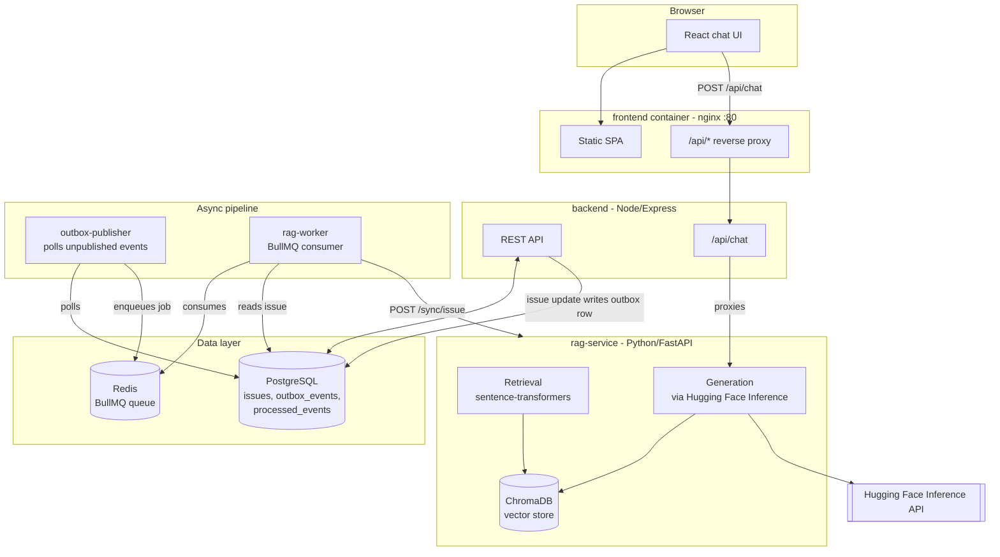

# Accessibility RAG Assistant

A full-stack Retrieval-Augmented Generation (RAG) system that answers questions about accessibility (WCAG) issues in a sample application, grounded in real issue data via vector search and an LLM.

**Live demo:** http://51.170.136.226 *(learning-project deployment on a free-tier VM — may occasionally be offline)*

## What this is

Most RAG tutorials stop at "embed some docs, query a vector store, call an LLM." This project also wires that up to a real backing application: issues live in Postgres, get embedded into a vector store, and any update to an issue propagates to the knowledge base asynchronously through an event-driven pipeline — not a manual re-index step.

## Architecture



**The interesting part:** editing an issue doesn't directly call the RAG service. It writes an `outbox_events` row in the same DB transaction as the update (the [transactional outbox pattern](https://microservices.io/patterns/data/transactional-outbox.html)), which `outbox-publisher` picks up and turns into a BullMQ job, which `rag-worker` consumes to re-sync that issue into Chroma. This decouples the write path from the RAG service being available, and makes the sync idempotent and retryable.

## Features

- Retrieval-augmented chat with conversation history and source citations
- Keyword-based structured filtering (severity/status/issue ID) layered on top of semantic search
- Async, event-driven knowledge base sync (not a cron job or manual trigger)
- Internal-API-key auth on admin/mutation routes, public chat rate-limited instead of key-gated (no client-side secret theater)
- Input validation (Zod) on write endpoints
- Dockerized end-to-end, including a production compose file with no ports exposed except the reverse proxy

## Tech stack

| Layer | Tech |
|---|---|
| Frontend | React 19, Vite |
| Backend | Node.js, Express, BullMQ |
| RAG service | Python, FastAPI, sentence-transformers, ChromaDB |
| LLM | Hugging Face Inference API |
| Data | PostgreSQL, Redis |
| Infra | Docker Compose, nginx (reverse proxy + static hosting) |

## Running it locally

Requires Docker.

```bash
git clone <this-repo-url>
cd react-rag-test

cp backend/.env.example backend/.env
cp rag-service/.env.example rag-service/.env
cp frontend/.env.example frontend/.env
# fill in HF_TOKEN / HF_API_KEY (huggingface.co/settings/tokens)
# and generate INTERNAL_API_KEY: node -e "console.log(require('crypto').randomBytes(32).toString('hex'))"

docker compose up -d --build

# seed sample data and build the initial vector index
docker compose exec api node src/scripts/migrateIssues.js
docker compose exec rag-service python3 -c "import os,urllib.request as u; req=u.Request('http://localhost:8000/sync', method='POST', headers={'x-internal-api-key': os.environ['INTERNAL_API_KEY']}); print(u.urlopen(req).read())"
```

Then open `http://localhost:5173`.

For a production-style deploy (no ports published except the reverse proxy), use `docker-compose.prod.yml` instead — see comments inside it.

## Tests

```bash
cd backend && npm test
```

Unit tests for input validation plus integration tests against the running stack (health checks, auth enforcement, chat flow).
